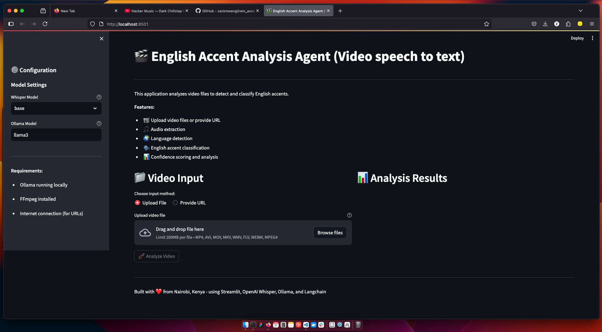
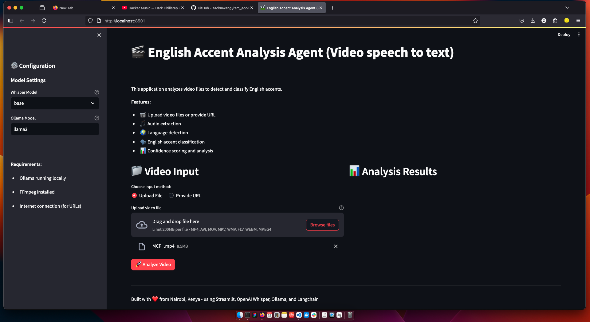
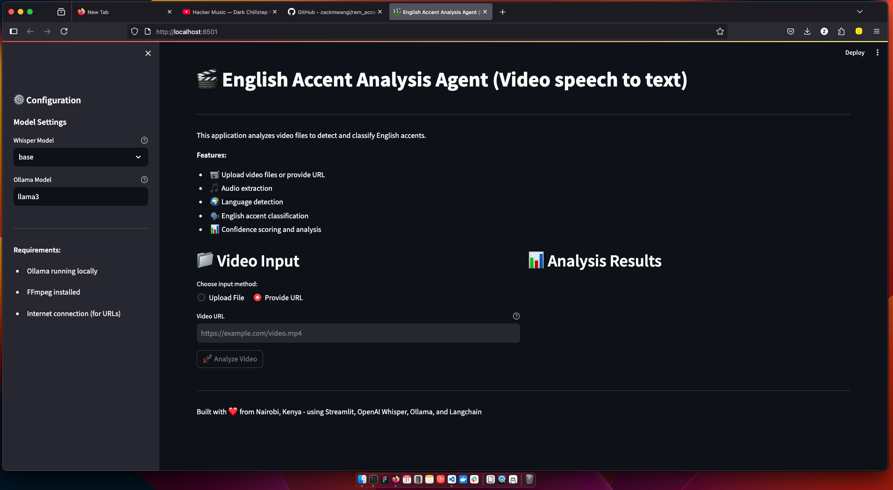
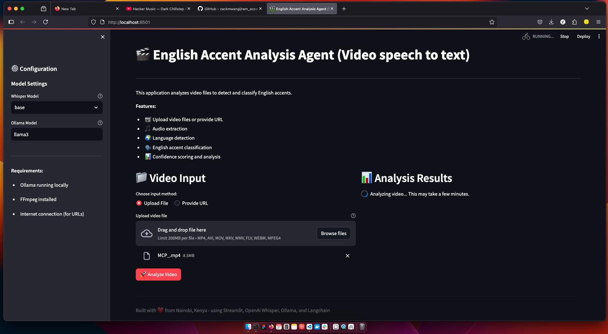
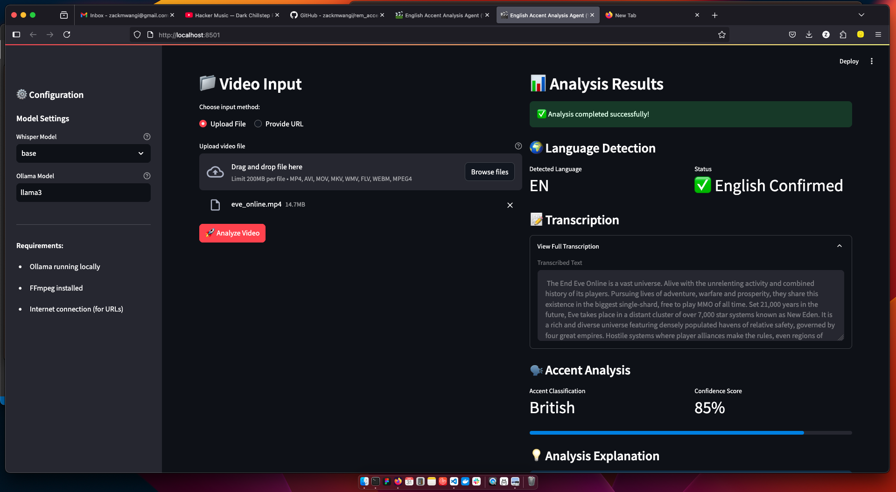
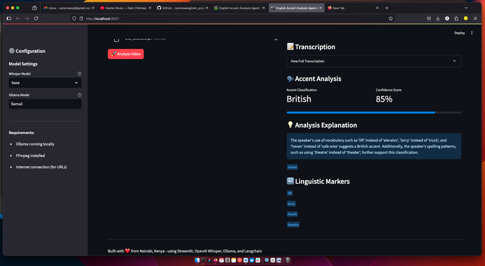
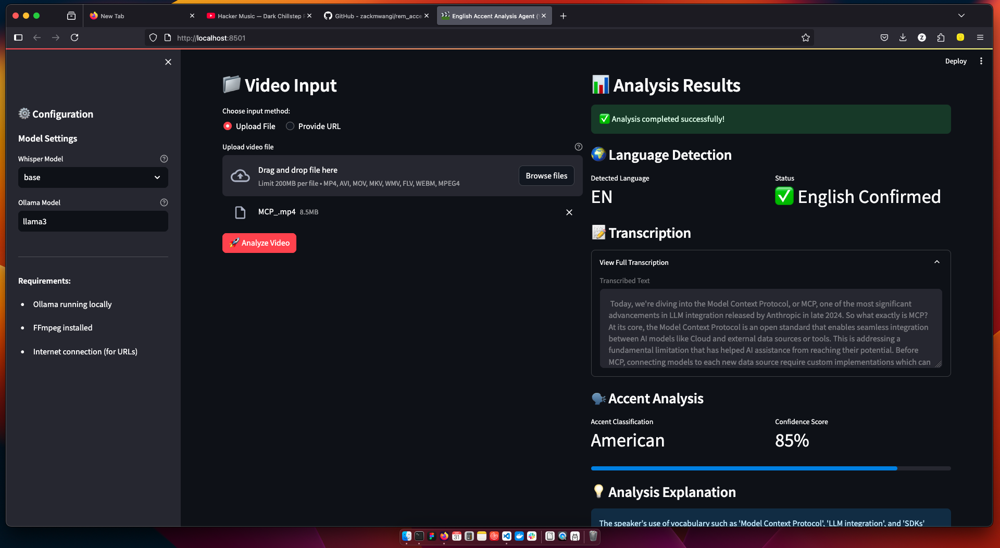
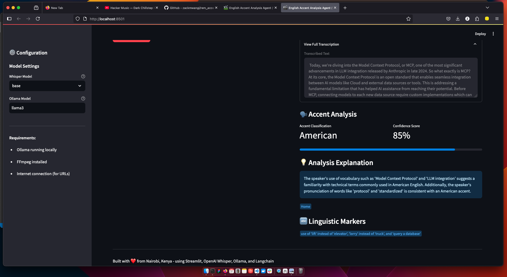

# REMWaste AI Solutions Engineer challenge
## English accent classifier agent tool
### Submitted by: Zack Mwangi [ zackmwangi@gmail.com ]
#### Categories: [automation, agents, STT/TTS, Classification, speech analysis ]
### Date: May 30, 2025

---

### TL;DR

This is a submission for the AI Solutions Engineer challenge[ (accesible here) ](./challenge.txt) exended by REMWaste. 

The submitted solution presents a moduar working version of an agent that:
- Accepts a video file from a URL or a direct file upload.
- Extracts audio from the file and detemines if the speech is in English
- For English speech, the accent of the speaker is detected and categorized as America, British, Australian amongst other options.
- A confidence level of the accent actegorization is also expressed (as a percentage).
- A brief explanation is given on the insights that may have been used to pick the accent category.

### Selected solution approach

There are several potential approaches to solving the challenge, including:
- A no-code approach, using off the shelf solutions
- A low-code approach, using an agent composition platform, such as n8n, make.com, etc.
- A high-code approach, using an agent development framework such as Langchain/LangFlow, crew.ai, LlamaIndex, etc.

The high-code approach was selected in this case to ensure maximum flexibility, adaptability and extensibility of the solution in light of the need to link this to other internal systems. Other approaches may become preferred in future upon clarification of the contextual requirements.

#### Tools used

- A local LLM installation (Meta Llama3 via Ollama)
- LangChain framework for implementing agent logic
- Other helper plugins such as openai-whisper, ffmeg
- A simple Streamlit interface was used to enable easy user interaction with the tool.

#### Installation and testing

- The source code and documentation is delivered via a github repo
- The solution requires python 3.10+ and is tested in a linux environment
- A production grade solution would be delivered as a docker container and hosted on a cloud platform.

- testing files have been included in the [ test_files folder ](./test_files/)

```sh

# - download project from git
git clone https://github.com/zackmwangi/rem_accent_challenge.git

# - change into the source directory containing implementation program logic
cd rem_accent_challenge

# - switch to the folder
cd solution_langchain

# - install ffmpeg library. If using docker, ensure library is installed via the docker file.
brew install ffmpeg

# - install required python libraries and tools
# - if using a virtual env, switch to the relevant virtual context
#
# python -m virtualenv .venv
# source .venv/bin/activate

pip install -r requirements.txt

streamlit run app.py

```
The app will then be accesible at a URL displayed when the streamlit UI runs.

#### Usage Screenshots

The app accepts a video upload or a URL

Once the video is received
- The app extracts the audio as text
- The language in the audio is determined and procesing only continues if English is detected.
- The speech trascription then determines the speaker's accent
- A confidence level is also displayed
- The interface optionally outputs a brief insight on the accent analysis

Here are some screenshots of the steps:
(Network mirror index screeshot)
##### - Welcome screen
(Welcome screen)


##### - Select video source - file
(Select video source - file)

##### - Select video source - URL
(Select video source - URL)

##### - Analysis in progress
()

##### - Analysis results - British accent detected
(Analysis in progress)

##### - Analysis results - British accent insights
(Analysis results - British accent insights)

##### - Analysis results - American accent detected
(Analysis results - American accent detected)

##### - Analysis results - American accent insights
(Analysis results - American accent insights)

### Other business use-cases

The functionality in the app may also be repurposed to:

- bridge accessiblity for people with hearing impairment, where a sign language widget will be overlayed on the page to display the transcribed text interpreted through a sign-language interpreting avatar. 

- connect to other process that utilize extracted text, such as storing the text to use as reference data for further analysis such as question answering in a recorded exam process, etc.

### Room for improvement

- The solution could be extended to use a FASTAPI interface to serve as an entrypoint for other agents or automated workflows that need to interact with the functionality it delivers.

- Commercial LLM APIs such as OpenAI GPT4 can be used in place of local LLM invocation. A fine-tuned model may also be used for better results.

- Once the operational constraints are well understood, the solution can be implemented in lower-code frameworks such as n8n or make.com for easier maintenance by non-technical operators or as required.

### Conclusion

The presented solution fulfills the challenge requirements in a simple, extensible and elegant way that serves the intended business purpose as required. The developer is open to answer any further queries around the implementation and how it can be put to commercial use or customized further.

Happy accenting!!